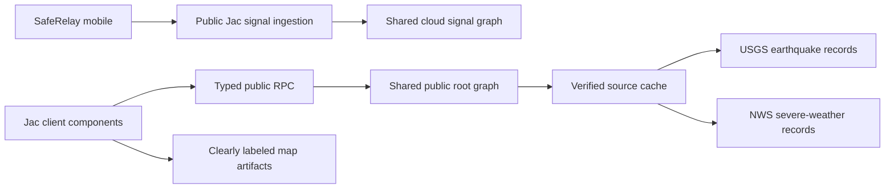

# SafeRelay

**Evidence-scoped emergency mesh operations, built entirely with Jac.**

SafeRelay's active web console monitors source-backed public hazard records and
preserves explicit unknown states for relay reports, receipts, responder
acknowledgements, and outcomes. It never substitutes generated operational
records. Synthetic artifacts are allowed only inside clearly labeled map
layers.

Created by Jerry Wen, Rishabh Bansal, and Aditya Das for the Alameda County
Hackathon 2025.

> The web console is not an emergency dispatch service. An empty evidence state
> stays empty until a real source record exists.

## Why Jac

SafeRelay uses Jac 0.34.7 as the full application runtime:

- **One language:** backend logic, graph schema, tests, routes,
  and JSX-like client components are all Jac.
- **Graph persistence:** verified source records attach to the shared public
  Jac root.
- **Typed public RPC:** `def:pub` functions become anonymous,
  client-callable endpoints with generated types.
- **One runtime:** `jac start` builds the client and serves the UI, APIs, and
  graph state together.
- **Live public feeds:** USGS earthquake and NWS severe-weather refreshes run on
  the Jac server with bounded timeouts. Failed refreshes retain verified cached
  records or report unavailable; they never create continuity examples.
- **Mobile cloud relay:** anonymous mobile clients can health-check and submit a
  validated, idempotent signal to the shared Jac cloud graph. Each receipt is
  evidence of server storage, not responder acknowledgement.

## Run It

Install [Jac](https://www.jac-lang.org/install/) and then:

```bash
export PROMETHEUS_ADMIN_PASSWORD="$(openssl rand -base64 32)"
export MAPBOX_ACCESS_TOKEN="<public Mapbox token>"
jac install
jac start --dev main.jac
```

Open:

- Landing experience: [http://localhost:8000](http://localhost:8000)
- Operations evidence monitor: [http://localhost:8000/ops](http://localhost:8000/ops)

No database, JavaScript build command, or Supabase project is required for a
single-replica deployment. The incident map uses a public Mapbox access token
from `MAPBOX_ACCESS_TOKEN`. Its synthetic markers are visibly labeled map
artifacts and are never included in operational counts or evidence.

## Verify It

```bash
jac check .
jac test
jac build main.jac
```

The test suite verifies cloud health, validated idempotent mobile ingestion,
honest empty source states, and legacy generated-record removal. See
[PARITY.md](./PARITY.md).

## Architecture



The former drill engine and its generated incident records are not part of the
web runtime.

## Source Layout

```text
main.jac                              Application entry point and client export
saferelay/store.jac                  Verified source cache and public endpoints
saferelay/store_test.jac             Evidence-boundary tests
saferelay/AppShell.jac               Public client router
saferelay/LandingPage.jac            Public experience
saferelay/VerifiedCommandCenter.jac  Active evidence monitor
styles/global.css                     Responsive application styling
jac.toml                              Jac runtime, client, and test configuration
PRODUCTION.md                         Production and JacHammer runbook
PARITY.md                             Old-to-Jac functional parity contract
```

## Public Contract

| Surface | Purpose |
| --- | --- |
| `get_disaster_feed` | Read only cached USGS/NWS source records |
| `refresh_disaster_feed` | Refresh USGS/NWS without generated fallback records |

All four endpoints are public. Hazard records and anonymous mobile relay
signals use the shared Jac graph. Ingestion validates bounds, deduplicates by
message ID, stores an unverified mobile report, and never claims responder
action. See [PRODUCTION.md](./PRODUCTION.md) for deployment and acceptance
gates.

## License

Copyright (c) 2025 SafeRelay Team. All Rights Reserved.

This is proprietary software. No copying, modification, distribution, or
resubmission to hackathons is permitted without explicit written permission.
See [LICENSE](./LICENSE) for the full terms.
